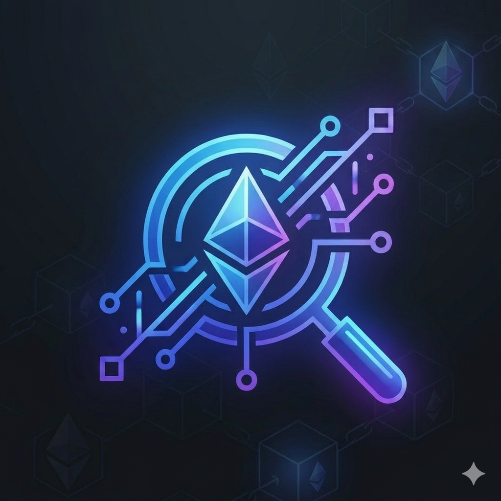

# EthScope — Ethereum Transaction Inspector

<p align="center">
  
</p>

**EthScope** is a focused, **frontend-only** web app for inspecting Ethereum transactions. It is aimed especially at **Web3 beginners and curious developers** who paste a transaction hash and want to **see what actually happened**—not only the headline fields (from, to, value), but **calldata**, **decoded function calls**, **event logs**, **gas**, **ERC-20 transfers**, and **raw JSON** side by side.

If you are learning how Ethereum works, this tool helps connect the dots between “a tx hash on a block explorer” and concepts like **ABI encoding**, **function selectors**, **topics**, and **receipt logs**.

---

## Why this project exists

Block explorers are great, but they can feel dense or scattered. EthScope is intentionally:

- **Educational** — surfaces selectors, raw input, and receipts so you can map UI back to protocol concepts.
- **Developer-oriented** — monospace hashes, collapsible raw sections, copy buttons.
- **Transparent about limits** — unverified contracts, empty calldata, and failed txs get **clear fallback UI** instead of opaque errors.

---

## Features

| Area | What you get |
|------|----------------|
| **Transaction overview** | Status, block, timestamp, from/to, value (ETH), gas used, gas price / max fee, nonce, links to explorers. |
| **Human-readable summary** | Short narrative derived from decoded call + logs (best-effort; not a formal audit). |
| **Function decoding** | Uses verified contract ABI + [viem](https://viem.sh/) `decodeFunctionData`. Falls back to **function selector + raw calldata** when ABI is missing or calldata is empty (`0x`). |
| **Event logs** | Expandable list; decodes logs when ABI is available; always shows topics + data. **ERC-20 `Transfer`** events are handled so token movements can be surfaced. |
| **Token transfers** | Cards for detected ERC-20 transfers; optional **symbol / decimals** via on-chain `readContract` when the token responds. |
| **Raw data** | Collapsible JSON for transaction, receipt, logs, and calldata—useful when learning or debugging. |
| **Networks** | Selector for Ethereum, Sepolia, Arbitrum, Optimism, Base, and Polygon (RPC must be configured per chain you use). |

**Explicit non-goals for MVP:** no backend, no database, no auth, no transaction tracing (`trace_*` / `debug_*`). Those stay optional future work.

---

## Tech stack

- **[Next.js](https://nextjs.org/)** (App Router) · React · TypeScript  
- **[Tailwind CSS v4](https://tailwindcss.com/)** — dark, minimal UI  
- **[Radix UI](https://www.radix-ui.com/)** — accessible primitives (accordion, select) styled like shadcn-style components  
- **[viem](https://viem.sh/)** — Ethereum reads: `getTransaction`, `getTransactionReceipt`, `getBlock`, `decodeFunctionData`, `decodeEventLog`, `readContract` (token metadata)

---

## Integrations

### 1. JSON-RPC (e.g. Alchemy, Infura, any HTTP endpoint)

All chain state comes from a standard **Ethereum JSON-RPC** provider over HTTPS:

- Fetch transaction by hash  
- Fetch receipt (status, gas used, logs)  
- Fetch block header for timestamp  
- Optional `eth_call` style reads for ERC-20 **symbol** / **decimals**

Configure URLs via **`NEXT_PUBLIC_*`** env vars so the app stays deployable on **Vercel** without a custom server.

### 2. Etherscan API v2 (verified ABIs)

Decoding **contract calls** and many **logs** needs the contract’s **ABI**. EthScope loads verified ABIs through **[Etherscan’s unified API v2](https://api.etherscan.io/v2/api)**:

- Base URL defaults to `https://api.etherscan.io/v2/api`  
- Each request includes **`chainid`** (see [V2 migration](https://docs.etherscan.io/v2-migration))  
- Same pattern supports multiple chains Etherscan aggregates (aligned with the networks wired in the app)

The API key is read from **`NEXT_PUBLIC_ETHERSCAN_API_KEY`**. That exposes the key to the browser—acceptable for a **personal / demo** frontend-only tool; use quota-aware keys and do **not** reuse high-privilege secrets.

### 3. Client-side caching

Lightweight **in-memory caches** reduce duplicate RPC and ABI requests during a session (e.g. revisiting the same contract address or hash).

---

## Project structure

```
src/
├── app/                 # Next.js App Router — layout, global styles, home page
├── components/          # Navbar, TxInput, overview, decoders, UI primitives
├── hooks/               # useTransaction — orchestrates fetch + decode pipeline
├── lib/                 # RPC client, Etherscan, decoder helpers, tx parsing, cache
└── utils/               # Formatting, log decoding helpers, address/hash shorten
```

---

## Getting started

### Prerequisites

- Node.js 18+ (20+ recommended)  
- npm or compatible package manager  

### Install

```bash
npm install
```

### Environment variables

Create **`.env.local`** in the project root (never commit real keys).

| Variable | Purpose |
|----------|---------|
| **`NEXT_PUBLIC_RPC_MAINNET`** | HTTPS RPC URL for Ethereum mainnet (or use fallback below). |
| **`NEXT_PUBLIC_ALCHEMY_RPC_URL`** | Optional fallback used for mainnet when `NEXT_PUBLIC_RPC_MAINNET` is unset. |
| **`NEXT_PUBLIC_RPC_SEPOLIA`**, **`NEXT_PUBLIC_RPC_ARBITRUM`**, **`NEXT_PUBLIC_RPC_OPTIMISM`**, **`NEXT_PUBLIC_RPC_BASE`**, **`NEXT_PUBLIC_RPC_POLYGON`** | RPC URLs for other networks when you select them in the UI. |
| **`NEXT_PUBLIC_ETHERSCAN_API_KEY`** | Etherscan API key for **ABI** (`getabi`). Required for full function/log decoding on verified contracts. |
| **`NEXT_PUBLIC_ETHERSCAN_API_URL`** | Optional. Override V2 base (default `https://api.etherscan.io/v2/api`). |

**Minimum to try mainnet:** one working mainnet RPC + Etherscan key for decoding.

### Run locally

```bash
npm run dev
```

Open [http://localhost:3000](http://localhost:3000), choose a network with RPC configured, paste a **transaction hash**, and click **Inspect**.

### Production build

```bash
npm run build
npm start
```

---

## Deployment (e.g. Vercel)

1. Push the repo to GitHub (or connect your Git provider).  
2. Create a Vercel project; set the same **`NEXT_PUBLIC_*`** variables in the project settings.  
3. Deploy.  

There is **no server component requirement** beyond static + Edge/Node hosting for Next.js; all Ethereum access is from the **browser** via public env vars.

---

## Learning outcomes (what beginners practice here)

- How a transaction **hash** maps to **tx + receipt** on RPC  
- Reading **`input`** (calldata): selector vs arguments; empty `0x` vs contract calls  
- How **verified ABIs** enable **decodeFunctionData** / **decodeEventLog**  
- Recognizing **ERC-20 Transfer** logs and relating them to token metadata  
- Why **unverified** or **proxy** contracts often decode partially or not at all  

---

## License / contributing

This repository is set up as a **portfolio / learning** project. Adjust `LICENSE` or contribution guidelines as you prefer.

---

**EthScope** — *See the transaction, not just the explorer row.*
